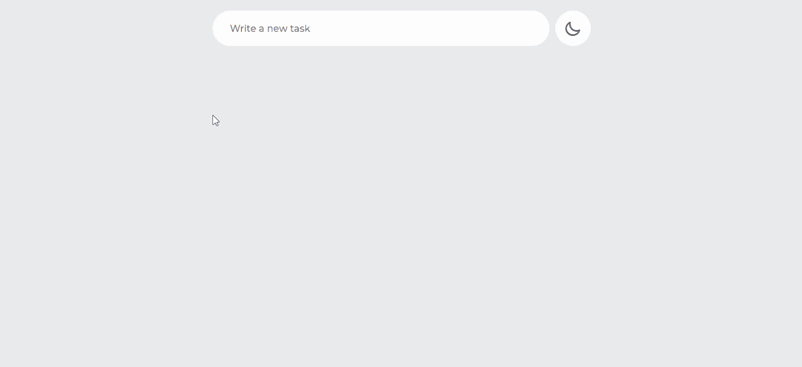
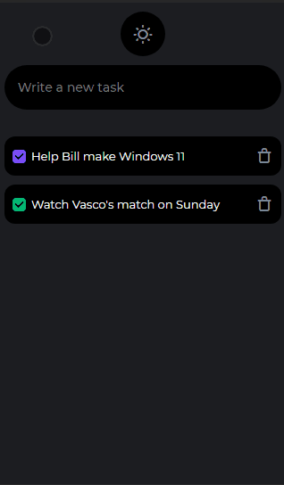

<div align="center">

  # To do list

  List your tasks easily and online

  <p>

   [Demo](#demo) •
   [About](#about-project) •
   [Technologies](#technologies) •
   [Getting started](#getting-started) •
   [License](#license)

  </p>

</div>


<h2 id="demo">📷 Demo</h2>
<div align="center">

  
  

</div>


<h2 id="about-project">ℹ About the project</h2>

This is a simple to-do-list project where you can save your next tasks separating them by categories and see your completed tasks.

### Features

- [x] Errors treating
- [x] Responsive style
- [x] Two themes options
- [x] Animations

<h2 id="technologies">🚀 Technologies</h2>

-  HTML
-  CSS
-  JavaScript
-  Node.js
-  MongoDB


<h2 id="getting-started">⚙ Getting started</h2>

1. Install the [Git](https://git-scm.com/) and the [Node.js](https://nodejs.org/) on your machine

2. Clone the repository:
```
git clone https://github.com/nicolasrafaelduma/ToDoList
```

3. Open the appropriate directory: `cd project`

4. Install dependencies:
```
npm install express dotenv mongoose ejs
```

5. Edit the **.env** file to your preferences

6. Start running with: `npm start`

7. I recommend that you use an IDE or a good text editor like [VSCode](https://code.visualstudio.com/).


<h2 id="license">📄 License</h2>

[MIT License](https://github.com/nicolasrafaelduma/ToDoList/blob/master/LICENSE)

---

<div align="center">

 **Developed by Nicolas Rafael Duma 👨🏻‍💻 [See my linkedin](https://www.linkedin.com/in/nicolasrafaelduma/)**

</div>
